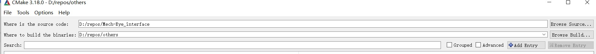
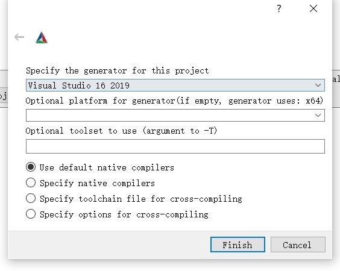
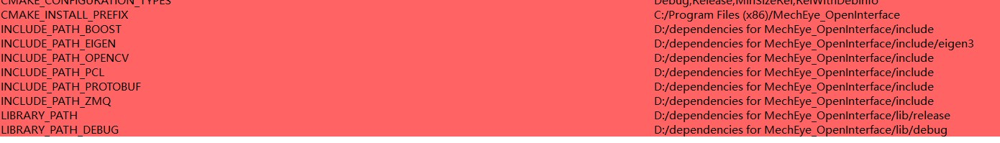
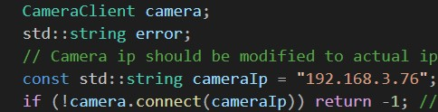

# Mech-Eye Interface
Official C++ interface for Mech-Eye cameras.
If you are using Mech-Eye cameras with firmware version older than 1.0.0, please switch to Branch 0.4.0.

## Installation

This part tells you how to configure and run project on Windows.

#### Prerequisites

In Order to use this interface you will need the following Prerequisites installed:
1. [Cmake](https://cmake.org/) -Version > 3.7 is required.
2. [Visual Studio](https://visualstudio.microsoft.com/) -Version > 2015 is recommended.
#### Using CMake to configure 


1. Clone the project and select project folder in Cmake. Select where you want to build.

   

2. Click the configure and choose the compiler(Visual Studio).

   

3. Extract files from **\Mech-Eye_interface\dependencies\dependencies for MechEye_OpenInterface.7z** and modify the path in the cmake according to the locations of these extracted files.

   

4. Click **Generate** and then **Open Project** and project will be opened in Visual Studio.

5. Add all extrated .dll files in Step 3 to System Path.

## Quick Start

Open the Visual Studio.

Modify the IP address according to the actual address in every sample_xxx.cpp files and build it.



Then VS will generate an exe file, usually **.\build\Debug\MechEye_OpenInterface.exe**.

Run this program and it will capture pictures and point clouds in the folder **D:/test/**.

## Project hierarchy

The following shows the hierarchy of project files

```
Mech-Eye_interface
├─ CMakeLists.txt
├─ README.md
├─ dependencies
│    └─ dependencies for MechEye_OpenInterface.7z
├─ img
│    ├─ ip.jpg
│    ├─ step.png
│    ├─ step1.jpg
│    ├─ step2.jpg
│    ├─ step2_2.jpg
│    └─ step3.jpg
├─ include
│    ├─ CameraClient.h
│    ├─ CameraCmd.h
│    ├─ PointCloudTools.h
│    ├─ ZmqClient.h
│    └─ sample.h
├─ json
│    ......
├─ sample
│    ├─ sample1_parameter.cpp
│    └─ sample2_ImgAndCloud.cpp
└─ src
       ├─ CameraClient.cpp
       ├─ PointCloudTools.cpp
       ├─ ZmqClient.cpp
       └─ main.cpp
```

* **dependencies**

  It contains all .dll and other dependencies needed by the project.

* **include**

  It contains all .h header files of interfaces.

* **json**

  Since C++ standard libraries don't contain any  json libraries, so this folder contains a third-party library for json.

* **sample**

  It contains 2 samples which briefly introduce the usage of interfaces.

* **src**

  It contains all source code, interface fucntions are defined in CameraClient.cpp. Main.cpp, sample1_parameter.cpp and sample2_ImgAndCloud are examples to show how to use interfaces.

## Brief Intro to interfaces

All interfaces and functions are in  **CameraClient.cpp**.

There are two main classes: CameraClient and ZmqClient. CameraClient is subclass of ZmqClient. You only need to focus on CameraClient.

* **CameraClient**

  * **connect()** : connect to the camera according to its ip address.

  * **captureDepthImg()** : capture a depth image and return it.

  * **captureColorImg()** : capture a color image and return it.

  * **getCameraIntri()**: get camera's intrinsic parameters.

  * **getCameraInfo()**: get camera's ip address.

  * **getCameraVersion()**: get camera's version number.

  * **getParameter()** : get the value of a specific parameter in camera.

  * **setParameter()** : set the value of a specific parameter in camera.

    **Attention**: Please be sure to know the meaning of your setting of parameters, **wrong setting could cause some errors in the interfaces!**

  * **captureRgbPointCloud()** : get a point cloud as pcl::PointXYZRGB


### Intro to samples

The original project provides 2 samples to show how to use interfaces. They are included under **.\sample**.

##### sample1_parameter.cpp

This sample mainly shows how to set camera's paramters like exposure time.

First, we need to know the actual ip address of camera and set it, and then connect:

```c++
CameraClient camera;
std::string error;
// Camera ip should be modified to actual ip address.
const std::string cameraIp = "192.168.3.146";
if (!camera.connect(cameraIp)) return -1; //return -1 if connection to camera fails

```

Then, we can get some brief info about camera:

```c++
std::cout << "Camera ID: " << camera.getCameraId() << std::endl
		<< "Version: " << camera.getCameraVersion() << std::endl;
```

Finally, we can set and get the value of a specific parameter, in this case, we choose exposure mode and time for color image:

```c++
std::cout << camera.setParameter("scan2dExposureMode",0) << std::endl;
std::cout << camera.getParameter("scan2dExposureMode", error) << std::endl;
std::cout << camera.setParameter("scan2dExposureTime", 20) << std::endl;
std::cout << camera.getParameter("scan2dExposureTime", error) << std::endl;

```

##### sample2_ImgAndCloud.cpp

After connected to the camera, the program can capture color images and depth images by camera, and also point clouds. We use PCL to store and process point clouds.

This sample capture color images, depth images and color point clouds and then save them on the disk.
