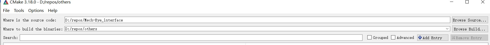
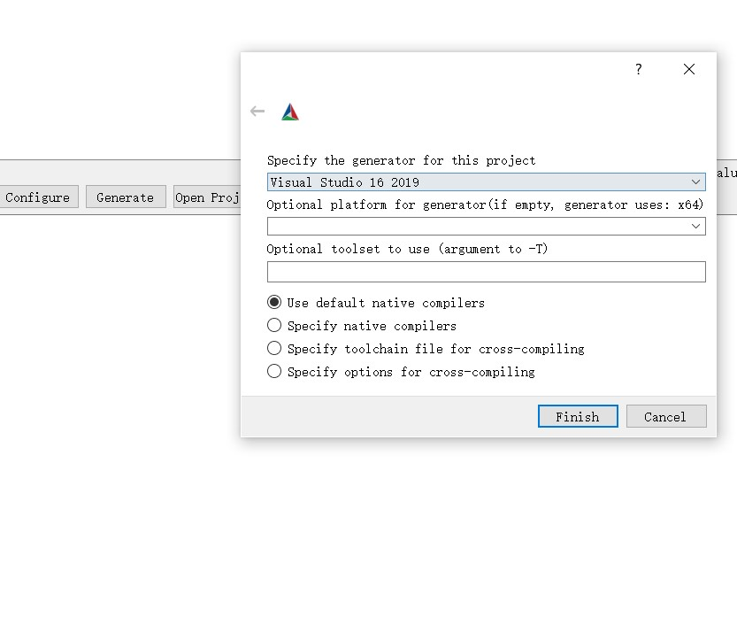
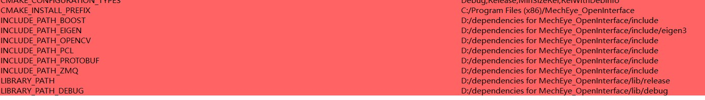
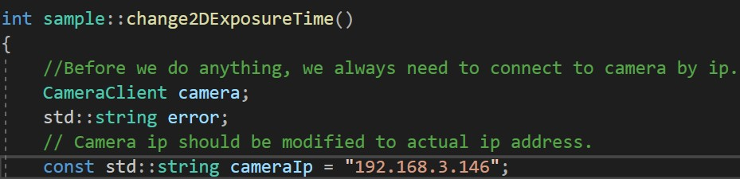

# Mech-Eye Interface
Official C++ interface for Mech-Eye cameras.

## Installation

This part tells you how to configure and run project on Windows.

### Prerequisites

In Order to use this interface you will need the following Prerequisites installed:
1. [Cmake](https://cmake.org/) -Version > 3.7 is required.
2. [Visual Studio](https://visualstudio.microsoft.com/) -Version > 2015 is recommended.
### Using CMake to configure 


1. Clone the project and select project folder in Cmake. Select where you want to build.

   

2. Click the configure and choose the compiler(Visual Studio).

   

3. Extract files from **\Mech-Eye_interface\dependencies\dependencies for MechEye_OpenInterface.7z** and modity the path in the cmake according to the locations of these extracted files.

   

4. Click **Open Project** and project will be opened in Visual Studio.

## Quick Start

Open the Visual Studio.

Modify the ip addr according to in every sample_xxx.cpp files and build it.



Then VS will generate an exe file, usually **.\build\Debug\MechEye_OpenInterface.exe**.

Run this program and you will some pictures and point cloud captured by your camera under **D:/test/**.

## Project hierarchy

The following shows the hierarchy of project files

```
Mech-Eye_interface
├─ CMakeLists.txt
├─ README.md
├─ dependencies
│    └─ dependencies for MechEye_OpenInterface.7z
├─ docs
│    ├─ MechEye_openinterface.pdf
│    ├─ ip.jpg
│    ├─ step.png
│    ├─ step1.jpg
│    ├─ step2.jpg
│    └─ step3.jpg
├─ include
│    ├─ CameraClient.h
│    ├─ CameraCmd.h
│    ├─ PointCloudTools.h
│    ├─ ZmqClient.h
│    └─ sample.h
├─ proto
│    ├─ cameraStatus.pb.cc
│    ├─ cameraStatus.pb.h
│    ├─ image.pb.cc
│    └─ image.pb.h
└─ src
       ├─ CameraClient.cpp
       ├─ PointCloudTools.cpp
       ├─ ZmqClient.cpp
       ├─ main.cpp
       ├─ sample1_set2Dexposure.cpp
       ├─ sample2_set3Dexposure.cpp
       ├─ sample3_getColorIMG.cpp
       ├─ sample4_getDepthIMG.cpp
       └─ sample5_getRGBCloud.cpp
```

* **dependencies**

  It contains all .dll dependencies needed by the project.

* **include**

  It contains all .h header files of this interface.

* **proto**

  It contains files generated by Google protobuf. It defines data structure of communication between interface and camera over the networks.

* **src**

  It contains all source code, interface fucntions are defined in CameraClient.cpp. main.cpp and sample_xxx.cpp  are examples to show how to use interfaces.

## Brief Intro to interfaces

All you interfaces and functions are in  **CameraClient.cpp**.

There are two main classes: CameraClient and ZmqClient. CameraClient is subclass of ZmqClient. You only need to focus on CameraClient.

* **CameraClient**

  * **connect()** : connect to the camera according to its ip address.
  * **captureDepthImg()** : capture a depth image and return it.
  * **captureColorImg()** : capture a color image and return it.
  * **getCameraIntri()**: get camera's intrinsics.
  * **getCameraIp()**: get camera's ip address.
  * **getCameraVersion()**: get camera's version number.
  * **getParameter()** : get the value of a spefic parameter in camera.
  * **setParameter()** : set the value of a spefic parameter in camera.
  * **captureRgbPointCloud()** : get a point cloud as pcl::PointXYZRGB

  

 
